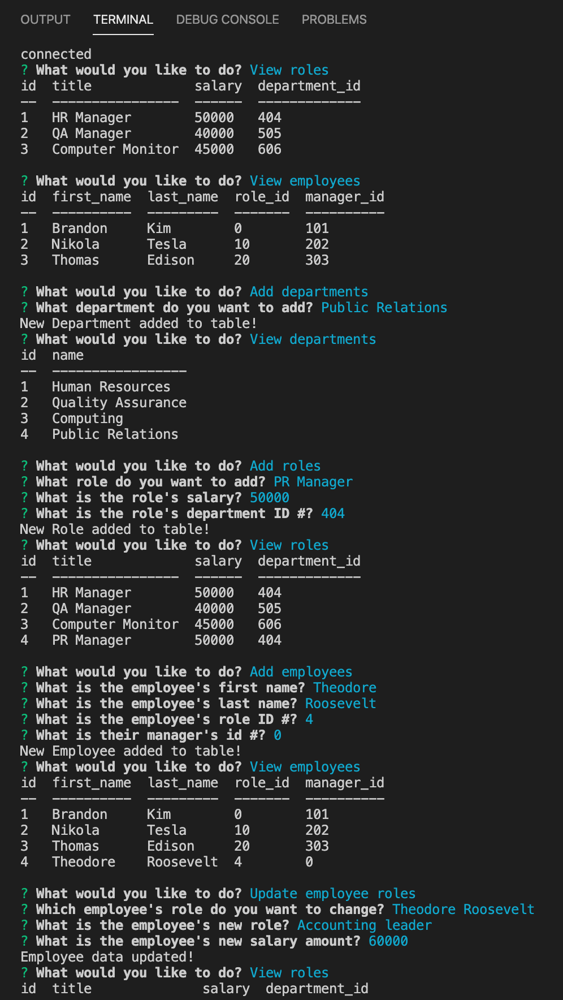

# HW12-Employee-Tracker
My submission for the HW12-Employee-Tracker Assignment.

1) Description: This application is designed to track the current status of the user's employee database and allow them to update their database by adding or deleting employee data as they see fit.  It makes use of the node, inquirer, and mySQL packages to display and control the database.

2) Screenshot: 